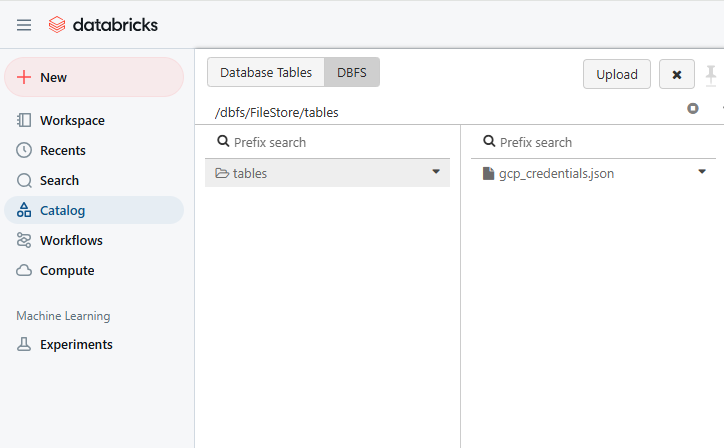
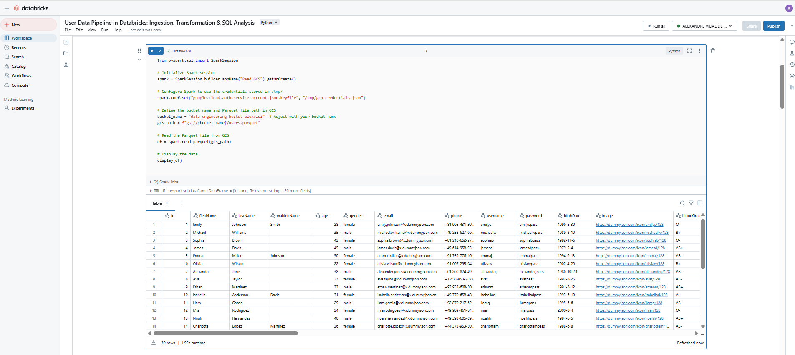

# End-to-End Data Pipeline with Databricks, Google Cloud Storage, and Spark

##  Project Overview
This project demonstrates a complete **data pipeline** for processing user data using **Databricks**, **Apache Spark**, and **Google Cloud Storage (GCS)**. It covers **data ingestion, transformation, and SQL-based analysis** using PySpark.

##  Project Structure
```
DATA PIPELINE PROJECT GCS SPARK DATABRICKS/
│── .vscode/                           # VSCode settings
│── config/                            # Configuration files
│   ├── config.json                    # General config
│   ├── gcp_credentials.json           # GCP service account credentials
│── data/                               
│   ├── raw/                           # Raw data files
│   │   ├── carts.parquet
│   │   ├── products.parquet
│   │   ├── users.parquet
│── images/                            # Screenshots of Databricks setup
│   ├── databricks/
│   │   ├── cluster_config.png
│   │   ├── load_data_spark.png
│   │   ├── load_google_credentials.png
│── notebooks_databricks/               
│   ├── User Data Pipeline in Databricks_ Ingestion, Transformation & SQL Analysis.ipynb
│── scripts/                            # Python scripts for automation
│   ├── extract_data.py                 # Data extraction script
│   ├── upload_to_gcs.py                # Upload script to GCS
│── venv/                               # Virtual environment
│── .env                                # Environment variables
│── .gitignore                          # Git ignored files
│── README.md                           # Project documentation
│── requirements.txt                    # Python dependencies
```

##  Technologies Used
- **Google Cloud Storage (GCS)**: Storage for raw data
- **Apache Spark (Databricks)**: Data processing and transformation
- **PySpark SQL**: SQL-based querying and analysis
- **Python**: Scripts for data extraction and ingestion
- **Parquet**: File format for efficient storage and processing

##  Workflow
### 1️. Data Ingestion
- Extracted data from an external API
- Stored as **Parquet** files in Google Cloud Storage (GCS)
- Uploaded via Python scripts (`upload_to_gcs.py`)

### 2️. Data Processing with Spark (Databricks)
- Loaded data from GCS into a **Databricks Notebook**
- Configured **Google Cloud credentials** for secure access
- Applied **PySpark transformations** for data cleaning and enrichment

### 3️. SQL Analysis with Spark SQL
- Created SQL tables from DataFrames
- Executed SQL queries for analysis
- Visualized transformed data in Databricks

## Setup & Execution
### 1️. Prerequisites
- **Google Cloud SDK** installed and authenticated
- Databricks Community Edition account
- Python **3.x** installed with dependencies from `requirements.txt`

### 2️. Run the Pipeline
#### 🔹 Step 1: Configure GCP Authentication
```sh
export GOOGLE_APPLICATION_CREDENTIALS=config/gcp_credentials.json
```

#### 🔹 Step 2: Upload Data to GCS
```sh
python scripts/upload_to_gcs.py
```

#### 🔹 Step 3: Load & Process Data in Databricks
- Open the **Databricks Notebook** (`notebooks_databricks/...ipynb`)
- Configure Spark with GCP credentials
- Run **PySpark transformations** and SQL queries

##  Sample Query in Databricks
```sql
SELECT age, gender, COUNT(*) as user_count
FROM users
GROUP BY age, gender
ORDER BY user_count DESC;
```

##  Screenshots
| Screenshot | Description |
|------------|-------------|
|  | Databricks cluster setup |
|  | Loading GCP credentials |
|  | Loading data into Spark |

##  Key Takeaways
- Successfully **ingested, transformed, and analyzed** data using Spark
- Applied **Databricks Notebooks** for end-to-end data pipeline execution
- Leveraged **SQL queries** for structured data analysis
- Stored data in **GCS and Parquet** for optimized storage & retrieval

##  Next Steps
- Implement **Airflow** for pipeline orchestration
- Deploy the pipeline to **Azure Databricks** for cloud-based execution
- Integrate **Power BI** for data visualization

##  About the Author
[Alexandre Vidal De Palol] | 

---

