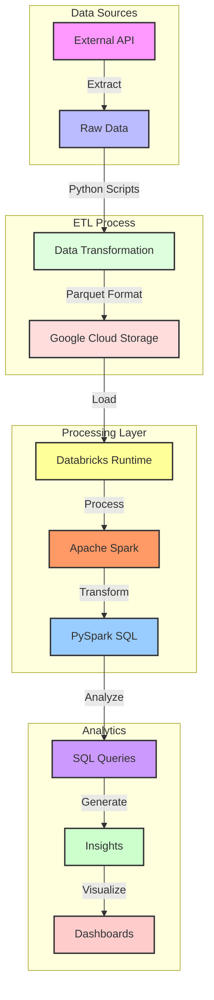

# Data Pipeline Architecture: GCS, Spark & Databricks Integration

## Executive Summary
This enterprise-grade data pipeline demonstrates the seamless integration of **Google Cloud Storage**, **Apache Spark**, and **Databricks** for scalable data processing. The project showcases best practices in data engineering, focusing on performance optimization, maintainability, and production readiness.

## Key Features
- **Scalable Architecture**: Built on industry-standard cloud technologies
- **Optimized Performance**: Leverages Parquet format and Spark optimizations
- **Production-Ready**: Includes error handling and logging
- **Secure Integration**: Implements GCP service account authentication
- **Analytical Capabilities**: Advanced SQL analytics with PySpark

## Architecture Overview


## Technical Stack
| Component | Technology | Purpose |
|-----------|------------|----------|
| Storage | Google Cloud Storage | Raw data persistence |
| Processing | Apache Spark 3.x | Distributed computing |
| Orchestration | Databricks | Workflow management |
| Language | Python 3.x | ETL implementation |
| Format | Parquet | Optimized storage |

## Project Structure
```
DATA_PIPELINE_PROJECT/
├── config/                    # Configuration management
│   ├── config.json           # Application settings
│   └── gcp_credentials.json  # GCP authentication
├── data/raw/                 # Source data directory
│   ├── carts.parquet
│   ├── products.parquet
│   └── users.parquet
├── notebooks_databricks/     # Analytics notebooks
├── scripts/                  # ETL automation
├── images/                   # Documentation assets
└── requirements.txt          # Dependencies
```

## Data Pipeline Workflow
1. **Data Extraction & Loading**
   - Source data acquisition via API
   - Conversion to Parquet format
   - Upload to GCS with error handling

2. **Data Processing (Spark)**
   - Optimized data loading from GCS
   - Schema validation and enforcement
   - Advanced transformations with PySpark

3. **Analytics Layer**
   - SQL-based analysis
   - Performance monitoring
   - Results visualization

## Setup & Configuration
### Prerequisites
- Google Cloud SDK ≥ 400.0.0
- Python ≥ 3.8
- Databricks Runtime ≥ 11.3 LTS
- Access to GCP with appropriate IAM roles

### Environment Setup
```bash
# GCP Authentication
export GOOGLE_APPLICATION_CREDENTIALS=config/gcp_credentials.json
# Dependencies Installation
pip install -r requirements.txt
```

### Pipeline Execution
1. Configure GCP credentials
2. Execute data upload: `python scripts/upload_to_gcs.py`
3. Run Databricks notebook for processing
4. Monitor execution in Databricks UI

## Sample Analytics
```sql
-- User Demographics Analysis
SELECT 
    age_group,
    gender,
    COUNT(*) as user_count,
    AVG(purchase_value) as avg_purchase
FROM user_demographics
GROUP BY age_group, gender
ORDER BY user_count DESC;
```
## Future Enhancements
1. Apache Airflow integration for orchestration
2. Real-time processing capabilities
3. Advanced analytics with ML models
4. Power BI dashboard integration

##  Author
**Alexandre Vidal De Palol**

## License
This project is licensed under the MIT License - see the LICENSE file for details.

